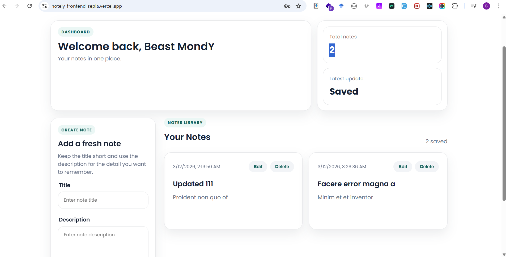

# Notely

Notely is a full-stack MERN notes app built for creating, updating, and managing personal notes in a simple workspace. It includes user authentication, protected note routes, and a clean dashboard for adding, editing, and deleting notes.

Live app: [https://notely-frontend-sepia.vercel.app/](https://notely-frontend-sepia.vercel.app/)

## Demo



## What the app does

- Lets users register and log in securely
- Creates personal notes with a title and description
- Updates existing notes from the dashboard
- Deletes notes with feedback via toast messages
- Protects note actions so each user only accesses their own notes

## Tech stack

- MongoDB
- Express
- React
- Node.js
- Redux Toolkit
- Vite

## Project structure

`frontend/` contains the React client.

`backend/` contains the Express API, authentication logic, and MongoDB models.

## Running locally

### Frontend

Create a `frontend/.env` file and add:

```env
VITE_API_URL=http://localhost:5000/api
```

Then run:

```bash
cd frontend
npm install
npm run dev
```

### Backend

Create a `backend/.env` file and add your values for:

```env
NODE_ENV=development
PORT=5000
MONGO_URI=your_mongodb_connection_string
JWT_SECRET=your_jwt_secret
```

Then run:

```bash
cd backend
npm install
npm run dev
```

## Deployment notes

The frontend reads its API base URL from `VITE_API_URL`.

The backend uses environment variables for secrets and database configuration, which makes it easier to deploy safely to platforms like Vercel.
